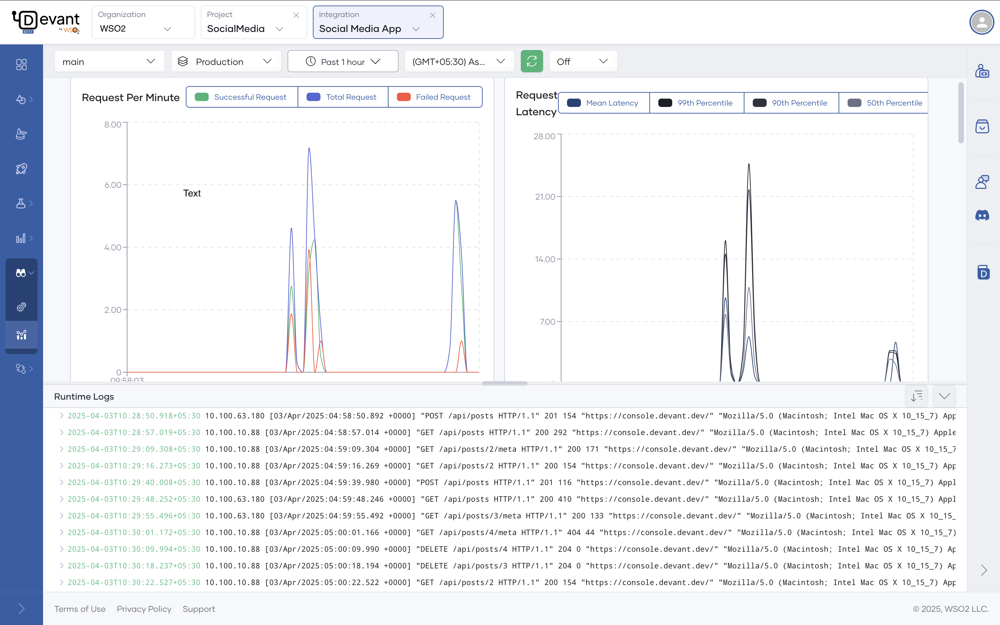
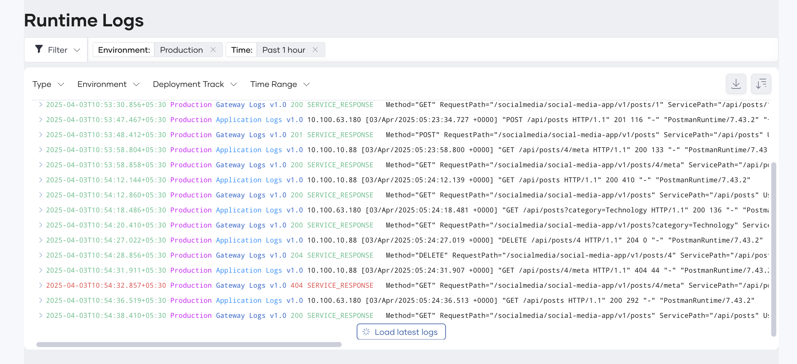

# Observability Overview

The Devant observability dashboard provides a comprehensive interface to visualize and monitor the performance of services deployed on Devant.

{.cInlineImage-full}

The Observability dashboard allows you to:

- View runtime logs generated over a specific timeframe.
- Observe the throughput and latencies of requests served over a given period.
- Observe the CPU and memory usage over a given period.
- Compare metrics side-by-side to facilitate efficient diagnosis.

## Logs

The **Logs** pane serves as a centralized view to observe logs of the components you deploy on Devant. This facilitates rigorous troubleshooting and analysis.

{.cInlineImage-full}

## Metrics

The **Metrics** pane provides a graphical representation of the following metrics:

- Request per minute
- Latency
- Memory usage
- CPU usage
- Data transfer
- Disk usage

{.cInlineImage-full}

By default, Devant renders this graph for the data generated within the past 24 hours. You can change the default time window by selecting the time range and zone from the options bar. To expand the graph, click and drag the cursor over the period you want to drill down.

You can view the Devant service logs in the **Runtime Logs** pane below the metrics. Clicking on a graph updates the **Runtime Logs** view to contain the corresponding log entries generated at that time. You can use these logs to identify the reasons for any anomalies you detect using the graph.
